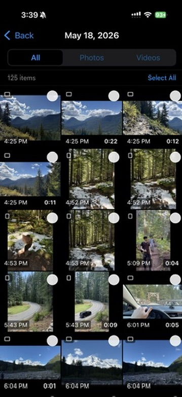
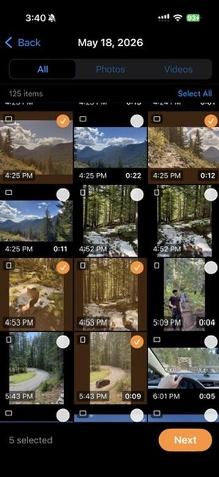
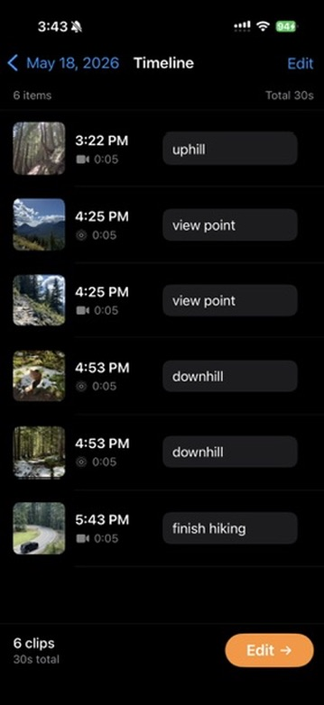
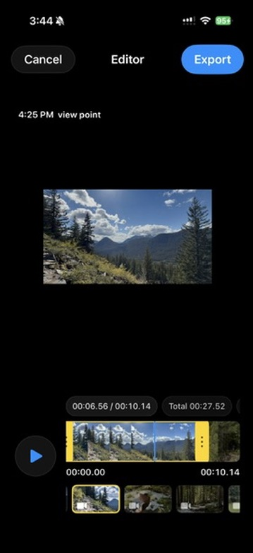

# Daily Log iOS

  

Daily Log is an iPhone app that turns photos, videos, and Live Photos from your camera roll into a timestamp-based daily vlog.

The app is designed for a simple daily workflow: choose a date, select the moments from that day, add short notes, lightly trim clips, and export one vertical video.

## App Flow

### Step 1 — Choose a Day

Pick Today, Yesterday, or a custom date from your camera roll.

### Step 2 — Select Media

Browse photos, videos, and Live Photos from that date. Use filters, select multiple items, and long-press a thumbnail for a popout preview.

### Step 3 — Review Timeline

Selected clips are sorted by capture time. Add a different note for each clip before editing.

### Step 4 — Edit Clips

Use the lightweight editor to preview, play, trim with yellow handles, switch Live Photos between Live and Photo mode, and choose a timestamp font.

### Step 5 — Export Daily Vlog

Export a 9:16 video with timestamp and per-clip notes burned into the video.

## Current MVP Features

- Date-based camera roll browsing
- Photos permission handling
- All / Photos / Videos filters
- Multi-select with selection persistence
- Long-press popout preview for media
- Timeline review with per-clip notes
- Reorder and delete clips before editing
- Lightweight timeline-first editor
- Video and Live Photo trimming
- Photo duration adjustment
- Live Photo Live/Photo mode toggle
- Timestamp font selection
- Original audio preservation when available
- SDR Rec.709 export for consistent color
- Export to Photos
- Temporary file cleanup

## Design Notes

This is intentionally not a full video editor. The MVP focuses on the daily log use case: fast selection, simple timeline edits, timestamps, notes, and export.

See [DESIGN.md](DESIGN.md) for the full product and technical design.

## Acknowledgements

Thanks to didisouzacosta for creating [didisouzacosta/VideoEditorKit](https://github.com/didisouzacosta/VideoEditorKit). The video editor experience in Daily Log references ideas from that repo.
